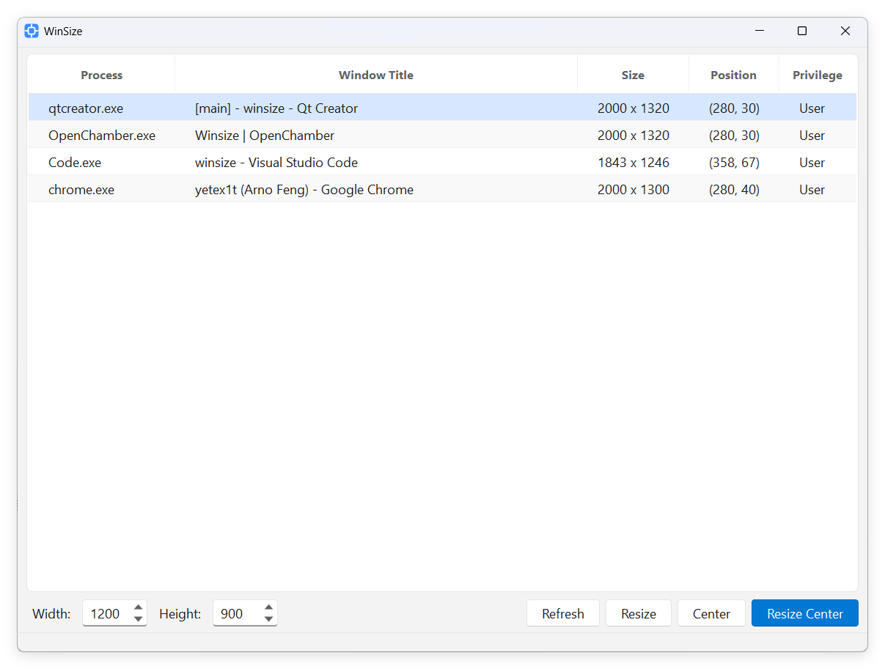

[English](/README.md) | [中文](/README_zh-CN.md)

<h1 align="center">
  
  <br>
  WinSize
  <br>
</h1>

<h3 align="center">
A lightweight and efficient window manager for sizing and positioning
</h3>

## Introduction

1. Enumerates visible top-level windows and shows process name, title, size, and position.
2. Supports one-click resize, center, and resize-and-center actions.
3. Built with Qt Widgets, with small footprint, fast startup, and clear runtime dependencies.

## Preview

<p align="center"></p>

## Download

Latest release: [GitHub Releases](https://github.com/yetex1t/winsize/releases/latest)

## Development

Requirements:

| Component | Version |
|---|---|
| Qt | `5.15.2` |
| MinGW-w64 | `8.1.0` |
| CMake | `>= 3.16` |
| Ninja | `1.12.1` |

Build commands:

```bash
# Debug
cmake -S . -B build/Debug -G Ninja -DCMAKE_BUILD_TYPE=Debug
cmake --build build/Debug

# Release
cmake -S . -B build/Release -G Ninja -DCMAKE_BUILD_TYPE=Release
cmake --build build/Release
```

## Acknowledgements

- [Qt](https://www.qt.io/)
- [OpenCode](https://opencode.ai/)

## License

[MIT](LICENSE)