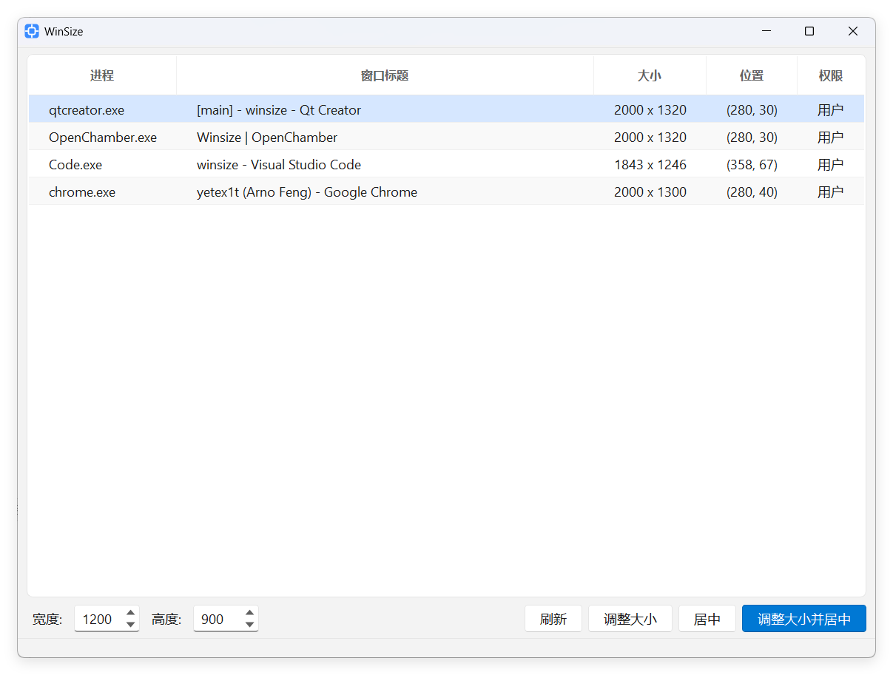

[English](/README.md) | [中文](/README_zh-CN.md)

<h1 align="center">
  
  <br>
  WinSize
  <br>
</h1>

<h3 align="center">
一款轻量高效的窗口大小与位置管理器
</h3>

## 介绍

1. 枚举当前可见顶层窗口，快速查看进程名、标题、尺寸与位置；
2. 支持一键调整窗口大小、窗口居中、调整后居中；
3. 基于 Qt Widgets 实现，体积小、启动快、依赖清晰。

## 页面展示

<p align="center"></p>

## 下载

最新版本下载地址：[GitHub Releases](https://github.com/yetex1t/winsize/releases/latest)

## 开发

环境要求：

| 组件 | 版本 |
|---|---|
| Qt | `5.15.2` |
| MinGW-w64 | `8.1.0` |
| CMake | `>= 3.16` |
| Ninja | `1.12.1` |

构建命令：

```bash
# Debug
cmake -S . -B build/Debug -G Ninja -DCMAKE_BUILD_TYPE=Debug
cmake --build build/Debug

# Release
cmake -S . -B build/Release -G Ninja -DCMAKE_BUILD_TYPE=Release
cmake --build build/Release
```

## 鸣谢

- [Qt](https://www.qt.io/)
- [OpenCode](https://opencode.ai/)

## 许可

[MIT](LICENSE)